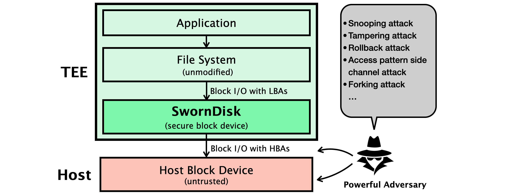
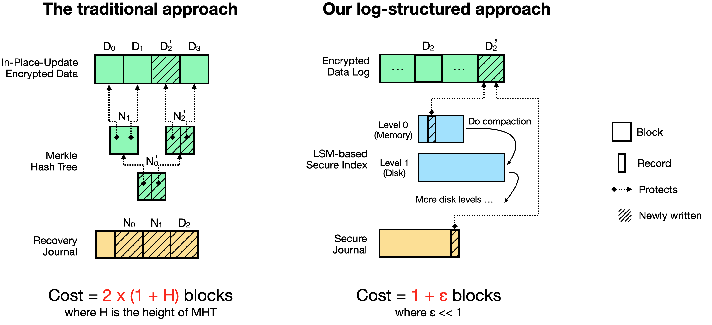

# SwornDisk项目

SwornDisk是一个面向可信执行环境（如AMD SEV）、适用于Linux内核的安全块设备。它使得Linux的现有文件系统（如Ext4）透明地获得对硬盘I/O的安全保护，抵御来自可信执行环境外的特权攻击者。

## 参赛信息

本项目参加[全国大学生操作系统比赛2022](https://os.educg.net/2022CSCC)的OS功能挑战赛道，选择 [题目47《面向可信执行环境的OS架构和特性》](https://github.com/oscomp/proj47-tee-os)。

参赛小组：
* 厦门大学 胡李宁
* 厦门大学 邱宇航
* 厦门大学 张芝豪

指导老师：
* 厦门大学 张一鸣 教授
* 蚂蚁集团 田洪亮 高级技术专家

## 项目背景

可信执行环境（[Trusted Execution Environment](https://en.wikipedia.org/wiki/Trusted_execution_environment)，后简称TEE）是一种新兴的、以硬件为基础的安全技术，而其中颇具潜力的一类TEE技术是基于虚拟机的TEE，比如[AMD SEV](https://developer.amd.com/sev/)、[Intel TDX](https://www.intel.com/content/www/us/en/developer/articles/technical/intel-trust-domain-extensions.html)、[ARM CCA](https://www.arm.com/architecture/security-features/arm-confidential-compute-architecture)等。这些虚拟机TEE技术通过使用内存加密、强隔离机制等技术手段，保证一个TEE虚拟机中的程序和数据无法被该虚拟机外部的攻击者获取或者篡改，甚至包括宿主机上的操作系统和虚拟机管理程序。可以预见的是，虚拟机TEE技术将被公有云提供商（如AWS、Azure、Google、阿里云等）广泛采用，提升云租户对云基础设施的信任，促进更多行业和客户的“上云”。

TEE虽然保护了TEE中CPU的状态信息和内存数据的安全，但是不能保证处于CPU之外的外设的安全性，比如硬盘I/O。TEE的强安全模型要求能防范具备特权的攻击者，而后者可以在TEE的整个生命周期中的任意时刻，窃取、篡改、或者回滚硬盘上的数据，这给TEE中的可信应用带来严重的安全威胁，因此**亟需一种安全而高效的TEE 硬盘I/O保护手段**。

## 项目目标

为了保护TEE的硬盘I/O，我们提出了SwornDisk，一个面向虚拟机TEE的、适用于Linux内核的安全块设备。SwornDisk使得上层的文件系统（如Ext4）可以在未经修改地情况下透明地获得TEE级别的硬盘I/O保护。

**图1. SwornDisk的威胁模型**

SwornDisk向上层文件系统提供3种主要的I/O操作：
* `read(lba, n, buf)`：从`lba`地址开始，将`buf`中的`n`个数据块写入硬盘；
* `write(lba, n, buf)`：从`lba`地址开始，读出硬盘的`n`个数据块存入`buf`；
* `flush()`：确保所有数据落盘。

注意上述与用户交互的`buf`中的数据都是明文，而SwornDisk写入下层物理存储设备时会自动做加密以及其他安全措施。而用户可见的地址`lba`，是逻辑块地址（Logical Block Address，即LBA），与SwornDisk真正写入TEE外的不可信存储设备上的地址，即主机块地址（Host Block Address，即HBA），是不同的。

对于上述的三种I/O操作，SwornDisk提供多种安全性质，包括但不限于：

* 机密性：任何用户写入的数据块都不会被泄露给攻击者（即无法被窃取）；
* 完整性：任何用户读回的数据块一定是用户之前写入的（即无法被篡改）；
* 新鲜性：任何用户读回的数据块一定是用户最后一次写入的（即无法被回滚）；
* 一致性：攻击者以任意时机和方式让TEE崩溃都无法影响上述安全保证。

SwornDisk的安全性高于Linux内核中现有各种文件I/O（如[eCryptFS](https://www.ecryptfs.org/)）或硬盘I/O保护方案（如[dm-crypt](https://en.wikipedia.org/wiki/Dm-crypt)），后者只保护机密性和/或完整性。

## 项目特色

### 基于日志结构的创新设计

**图2. SwornDisk更新一个数据块（以D2为例）的开销远小于传统方案**

在传统方案中，为了同时实现前述四种安全性质，采用的[Merkle Hash Tree (MHT)](https://en.wikipedia.org/wiki/Merkle_tree)来保护原地更新，同时引入一个恢复日记，在崩溃时做恢复。这种做法的缺点是有严重的写放大问题。如下左图所示，随机写1个数据块（比如D2）会导致2个MHT节点的更新，外加3个日志块的写入。一般来说，写放大的倍数可能高达2 x (1 + H)倍，其中H是MHT的高度。

为了避免上述的写放大问题，SwornDisk采用了一种全新的日志结构（log-structured）的设计。如下右图所示，该日志结构的设计包含三个层面的日志（logging）：一个加密的数据日志，一个基于[Log-Structured Merge Tree（LSM-tree）](https://en.wikipedia.org/wiki/Log-structured_merge-tree)的安全索引，以及一个安全日志。安全索引保护数据日志，而安全日志又保护安全索引。最终达到的效果是，更新一个数据块（比如D2），只需要向加密数据日志追加写1个新的数据块，1条索引记录，以及1条日志记录。写放大比仅为1  + ε，其中ε << 1。

该新型日志结构的设计，使得SwornDisk的随机写性能大幅优于传统方案，也令SwornDisk的总体I/O开销较低，可以满足实用应用的需求。关于设计的更多细节，见我们（尚未投稿的）[英文版论文](docs/sworndisk_preview_version_20220812.pdf)。

### C/Rust双语言的工程实践

为了在不侵入式地修改Linux内核的前提下给Linux增加SwornDisk这种新型安全块设备，我们基于Linux内核的[Device Mapper子系统](https://www.kernel.org/doc/html/latest/admin-guide/device-mapper/index.html)来实现SwornDisk。Device Mapper子系统使得开发者可以通过编写新的Linux内核模块的方式来增加新的逻辑块设备。

选定了开发框架之后，我们的第二个重要决定是选择编程语言。传统来说，C语言是开发Linux（除了汇编语言以外）的唯一选项。但近几年，Rust语言因其内存安全、线程安全、以及媲美C语言的性能，在系统编程领域大放异彩，甚至Linux社区也开始探索对Rust语言的支持。考虑到SwornDisk的目标场景是TEE，其用户群体对安全性非常关注，因此我们也希望采用内存安全的Rust语言来编写SwornDisk。但又考虑到Linux对Rust语言的尚处早期，我们在项目初期无法判断采用Rust语言是否的确可行，因此我们最终决定同时开发C和Rust两个版本的SwornDisk。

最终结果是，我们同时用C和Rust两个语言成功地开发出了SwornDisk。C版本大概包含5700行代码，实现了我们前述论文中描述的大部分功能。Rust版本包含4500行代码，实现了核心功能，成功验证了使用Rust语言的可行性。值得一提的是，我们扩展了[Rust for Linux项目](https://github.com/Rust-for-Linux)，开发出了Rust版本的Linux Device Mapper框架。SwornDisk的Rust实现便是基于该框架实现。

我们未来计划继续完善SwornDisk以及Rust版Device Mapper框架的实现，并希望最终能将我们代码贡献给Linux内核主干。

## 项目演示
- [C版本](https://www.bilibili.com/video/BV1YL4y1K7cY/)
- [Rust版本](https://www.bilibili.com/video/BV1NB4y197Et/)

## 编译和测试

* [C版本](./docs/c/sworndisk-linux-c-compile-and-run.md)
* [Rust版本](./docs/rust/compile-and-run.md)

## 技术细节

* [C版本](./docs/c/SwornDisk-Linux-C-Documentation.md)
* [Rust版本](./docs/rust/sworndisk-rust-implementation-details.pdf)

## 开源许可

本项目采用BSD/GPL双开源许可。你使用本项目代码时，可以任选其中任意一个许可。

