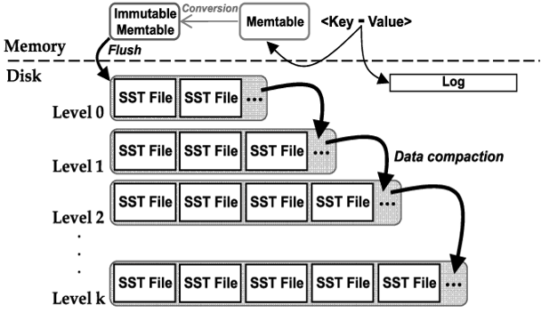

# SwornDisk Linux C Documentation

[toc]

# 1 代码组织

## 1.1 代码目录结构

```Bash
.
├── Kconfig    # 内核编译配置文件
├── LICENSE    # GPL2 协议
├── Makefile    # 项目构建脚本
├── Module.symvers    
├── README.md    # 说明文档
├── modules.builtin 
├── modules.order
├── run-dmtarget.sh    # 编译、测试脚本
└── sworndisk    # SwornDisk源文件目录
    ├── include
    │   ├── async.h    # 异步任务API
    │   ├── bio_operate.h    # bio结构体操作相关函数
    │   ├── bloom_filter.h    # 布隆过滤器
    │   ├── cache.h    # 缓存
    │   ├── crypto.h    # AEAD加、解密算法
    │   ├── disk_structs.h    # DiskArray、DiskBitset类型
    │   ├── dm_sworndisk.h    # DM-SwornDisk结构体声明
    │   ├── hashtable.h    # 动态扩容的哈希表
    │   ├── iterator.h    # 迭代器接口声明
    │   ├── lsm_tree.h    # LSM Tree
    │   ├── memtable.h    # MemTable
    │   ├── metadata.h    # 元数据，包括SuperBlock、Index Region、Checkpoint Region
    │   ├── segment_allocator.h    # 段分配器
    │   └── segment_buffer.h    # 段缓冲区
    ├── source
    │   ├── async.c
    │   ├── bio_operate.c
    │   ├── bloom_filter.c
    │   ├── cache.c
    │   ├── crypto.c
    │   ├── disk_structs.c
    │   ├── dm-sworndisk.c
    │   ├── hashtable.c
    │   ├── lsm_tree.c
    │   ├── memtable.c
    │   ├── metadata.c
    │   ├── segment_allocator.c
    │   └── segment_buffer.c
    └── test
        └── dm-sworndisk-test.c    # 单元测试
```

## 1.2 Device Mapper Framework

### 1.2.1 原理

- Device Mapper 是 Linux 内核用来将块设备映射到虚拟块设备的框架，它支持许多高级卷管理技术。Device Mapper 不同于 AUFS、ext4、NFS 等，因为它并不是一个文件系统（File System），而是 Linux 内核映射块设备的一种技术框架。提供的一种从逻辑设备（虚拟设备）到物理设备的映射框架机制，在该机制下，用户可以很方便的根据自己的需要制定实现存储资源的管理策略。

- 当前比较流行的 Linux 下的逻辑卷管理器如 LVM2（Linux Volume Manager 2 version)、EVMS(Enterprise Volume Management System)、dmraid(Device Mapper Raid Tool)等都是基于该机制实现的。值得一提的是 Device Mapper 工作在块级别，并不工作在文件级别。Device Mapper 自 Linux 2.6.9 后编入 Linux 内核，所有基于 Linux 内核 2.6.9 以后的发行版都内置 Device Mapper。

- Device Mapper主要分为用户空间部分和内核空间部分。用户空间相关部分主要负责配置具体的策略和控制逻辑，比如逻辑设备和哪些物理设备建立映射，怎么建立这些映射关系等。


- 内核中主要提供完成这些用户空间策略所需要的机制，负责具体过滤和重定向 IO 请求。通过不同的驱动插件，转发 IO 请求至目的设备上。

- Device Mapper 作为 Linux 块设备映射技术框架，向外部提供逻辑设备。包含三个重要概念，映射设备（mapped device），映射表（map table），目标设备（target device）。映射设备即对外提供的逻辑设备，映射设备向下寻找必须找到支撑的目标设备。映射表存储映射设备和目标设备的映射关系。目标设备可以是映射设备或者物理设备，如果目标设备是一块映射设备，则属于嵌套，理论上可以无限迭代下去。简而言之，Device Mapper 对外提供一个虚拟设备供使用，而这块虚拟设备可以通过映射表找到相应的地址，该地址可以指向一块物理设备，也可以指向一个虚拟设备。映射表，是由用户空间创建，传递到内核空间。映射表里有映射设备逻辑的起始地址、范围、和表示在目标设备所在物理设备的地址偏移量以及Target 类型等信息（注：这些地址和偏移量都是以磁盘的扇区为单位的，即 512 个字节大小，所以，当你看到 128 的时候，其实表示的是 128*512=64K）。映射驱动在内核空间是插件，Device Mapper 在内核中通过一个一个模块化的 Target Driver 插件实现对 IO 请求的过滤或者重新定向等工作，当前已经实现的插件包括软 Raid、加密、多路径、镜像、快照等，这体现了在 Linux 内核设计中策略和机制分离的原则。Device Mapper 中的 IO 流处理，从虚拟设备（逻辑设备）根据映射表并指定特定的映射驱动转发到目标设备上。

### 1.2.2 在 Device Mapper上做出的改动

#### （1）修改 Kconfig 文件

- 在 Device Mapper 原有的 Kconfig 文件添加如下内容：

```undefined
# SwornDisk 模块配置
config DM_SWORNDISK
    tristate "SwornDisk" # 支持三种模式：n（不编译）/m（LKM形式编译）/y（编译进内核）
    depends on BLK_DEV_DM    
    select CRC32   
    select CRYPTO
    select CRYPTO_CBC
    select DM_BUFIO
    select DM_PERSISTENT_DATA

# SwornDisk 单元测试模块配置
config DM_SWORNDISK_TEST
        tristate "Test for SwornDisk" if !KUNIT_ALL_TESTS
        depends on DM_SWORNDISK && KUNIT=y
        default KUNIT_ALL_TESTS
```

这样 SwornDisk 模块就能在内核的 .config 配置文件中看到

- 通常在内核源码的根目录使用 make menuconfig 调整编译配置


- SwornDisk 依赖 BLK_DEV_DM 选项，其必须先被 Enable 才能选中 SwornDisk

- select 是反向依赖，如果勾选 SwornDisk，select 后面的模块也会被勾选

#### （2）修改 Makefile 文件

- 配置编译中间产物obj文件的依赖，

```undefined
sworndisk-y       += sworndisk/source/dm-sworndisk.o sworndisk/source/metadata.o sworndisk/source/memtable.o sworndisk/source/bio_operate.o sworndisk/source/crypto.o sworndisk/source/segment_allocator.o sworndisk/source/segment_buffer.o sworndisk/source/cache.o sworndisk/source/disk_structs.o sworndisk/source/lsm_tree.o sworndisk/source/bloom_filter.o sworndisk/source/async.o sworndisk/source/hashtable.o
sworndisk-test-y += sworndisk/test/dm-sworndisk-test.o
```

- 配置链接方式，

```undefined
obj-$(CONFIG_DM_SWORNDISK)           += sworndisk.o
obj-$(CONFIG_DM_SWORNDISK_TEST) += sworndisk-test.o
```

CONFIG_DM_SWORNDISK 和 CONFIG_DM_SWORNDISK_TEST 都是在 menuconfig 阶段配置的，分为三种情况：

1. n：不编译

2. y：直接编译进内核

3. m：以模块的形式编译，生成 .ko 格式文件

- 配置 Device Mapper 模块的依赖文件列表

```Bash
ifeq ($(CONFIG_DM_SWORNDISK),y)
dm-mod-objs         += sworndisk/source/dm-sworndisk.o
endif

ifeq ($(CONFIG_DM_SWORNDISK_TEST),y)
dm-mod-objs         += sworndisk/test/dm-sworndisk-test.o
endif
```

# 2 编译、运行、测试

## 2.1 编译 Linux Kernel

### 2.1.1 获取 Linux Kernel 源码

```Bash
$ wget https://www.kernel.org/pub/linux/kernel/v5.x/linux-5.17.1.tar.xz
```

### 2.1.2 解压内核源码

```Bash
$ xz -d linux-5.17.1.tar.xz
$ tar xvf linux-5.17.1.tar
$ cd ./linux-5.17.1
```

### 2.1.3 安装依赖、配置

```Bash
$ sudo apt-get install dpkg-dev libncurses5-dev openssl libssl-dev build-essential pkg-config libc6-dev libc6-dev flex libelf-dev zlibc minizip libidn11-dev libidn11-dev bison dwarves
$ make mrproper
$ cp -v /boot/config-$(uname -r) .config
'/boot/config-5.4.0-105-generic' -> '.config'
$ make prepare
$ make scripts
```

- 编辑.config文件，


找到 CONFIG_SYSTEM_TRUSTED_KEYS，将值置空；

找到 CONFIG_SYSTEM_REVOCATION_KEYS，将值置空。

### 2.1.4 编译、安装内核

```Bash
$ make -j$(nproc)
$ sudo make modules_install
$ sudo make install
```

- 重启，选择刚安装的内核版本进入

## 2.2 编译 SwornDisk

### 2.2.1 克隆 SwornDisk 源码

```Bash
$ git clone git@github.com:occlum/sworndisk-linux-c.git
```

### 2.2.2 添加 SwornDisk 到内核源码

- 移除内核源码的drivers/md目录，

```Bash
$ cd linux-5.17.1/drivers/
$ rm -rf -r md/
```

- 将sworndisk源码复制到drivers目录下，并重命名为md

- 开始编译SwornDisk，

```Bash
$ cd md
$ cd ../../
$ make CONFIG_DM_SWORNDISK=m CONFIG_DM_PERSISTENT_DATA=m M=drivers/md
$ make modules_install M=drivers/md
$ cd drivers/md
```

## 2.3 加载并创建 SwornDisk

### 2.3.1 加载 SwornDisk 驱动模块

```Bash
$ modprobe -r sworndisk dm-persistent-data 
$ modprobe dm-persistent-data
$ modprobe sworndisk
```

### 2.3.2 **创建 SwornDisk 虚拟映射块设备**

- `<size>`: 磁盘扇区数量，扇区大小为 512B

- `<data_dev>`: 数据磁盘对应设备文件

- `<meta_dev>`: 元数据磁盘对应设备文件

- `<name>`: 磁盘名称

```Bash
$ echo 0 <size> sworndisk <data_dev> <meta_dev> 0 | sudo dmsetup create <name>
```

- 实例，

```Bash
# 创建一个 70GB 的 SwornDisk 虚拟块设备
$ echo 0 146800640 sworndisk /dev/sdb /dev/sdc 0 | dmsetup create sworndisk
```

元数据磁盘的容量需要根据设备扇区数量预估，现在的实验环境/dev/sdb容量为75GB，/dev/sdc容量为15GB。

## 2.4 测试

### 2.4.1 fio 性能测试

- fio 性能测试配置文件参考：

```Bash
# fio.conf

[global]
ioengine=sync
thread=1
norandommap=1
randrepeat=0
runtime=60
ramp_time=6
size=4G
direct=1
filename=/dev/mapper/sworndisk

[write4k-rand]
stonewall
group_reporting
bs=4k
rw=randwrite
numjobs=1
iodepth=32

[write64k-seq]
stonewall
group_reporting
bs=64k
rw=write
numjobs=1
iodepth=32

[read4k-rand]
stonewall
group_reporting
bs=4k
rw=randread
numjobs=1
iodepth=32

[read64k-seq]
stonewall
group_reporting
bs=64k
rw=read
numjobs=1
iodepth=32
```

- 测试命令，

```Bash
$ fio fio.conf
```

### 2.4.2 单元测试

- KUnit 为 Linux 内核中的单元测试提供了一个通用框架。使用 KUnit，可以定义称为测试套件的测试用例组。测试要么在内核启动时运行（如果是内置的），要么作为模块加载。 KUnit 会在内核日志中自动标记并报告失败的测试用例。测试结果以 TAP 格式显示。

- KUnit 官方文档：https://www.kernel.org/doc/html/latest/dev-tools/kunit/index.html

# 3 核心逻辑

## 3.1 初始化 SwornDisk Device Mapper 目标设备

- 初始化并创建 SwornDisk 虚拟块设备通过 dmsetup create 命令完成，执行该命令会触发 SwornDisk 的 **dm_sworndisk_target_ctr** （constructor）回调函数。在 ctr 函数中，主要做的事情是向 Device  Mapper 框架注册 SwornDisk 虚拟块设备、读取或创建 SwornDisk 的关键数据结构，初始化 SwornDisk 的上下文对象。具体地来说：

1. 解析 dmsetup 的参数，获取数据磁盘和元数据磁盘的设备路径

2. 在 Device Mapper 的 Table 中注册设备

3. 从 Meta Device 中读取或初始化超级块、Checkpoint

4. 创建数据段缓冲区、段分配器、bio 处理队列和工作队列等

5. 创建 LSM Tree 结构，包括 MemTable和在磁盘索引区的各个层级描述

6. 将所有在 SwornDisk 生命周期所需用到的结构与对象包装到全局单例对象 sworndisk 中

## 3.2 卸载 SwornDisk Device Mapper 目标设备

- 卸载 SwornDisk 虚拟块设备通过 dmsetup remove 命令完成，这将调用**dm_sworndisk_target_dtr** 函数，并从系统的 Device Mapper Table 中释放 SwornDisk 注册的虚拟块设备

- **dm_sworndisk_target_dtr** 函数主要做的事情是：

1. 将数据段缓冲区、MemTable的数据 Flush 到磁盘

2. 销毁 SwornDisk 设备运行期的上下文数据结构

3. 释放数据磁盘和元数据磁盘的引用

## 3.3 处理 bio

- 当文件系统或用户态程序向 SwornDisk 虚拟块设备写入或读取数据时，Device Mapper 框架会回调 **dm_sworndisk_target_map** 函数

- 上层的读、写请求被封装在 bio 结构体中，SwornDisk 将其加入到队列 **deferred_bios** 中。这是一个全局共享的 **bio_list**，使用自旋锁保护，所以是并发安全的

- 将处理 I/O 的 Worker **deferred_bio_worker** 加入到全局 **CMWQ** 中（同一个 Worker 只会被加入到工作队列中一次）。**deferred_bio_worker** 绑定了 I/O 的处理函数 **process_deferred_bios**，

```C
switch (bio_op(bio)) {
    case REQ_OP_READ:
        timeout = down_timeout(&sworndisk->max_reader, msecs_to_jiffies(300));
        go(async_read, bio);
        break;
    case REQ_OP_WRITE:
        sworndisk_do_write(bio);
        break;
}
```

对于读取请求就发起一个异步任务进行处理；

对于写请求直接调用 sworndisk_do_write 处理

- 对于其他的请求，比如 **FLUSH** 请求，SwornDisk 将其重定向到数据磁盘，然后返回 **DM_MAPIO_REMAPPED** 给 Device Mapper 框架， 这个请求就会被重新发到数据磁盘上。

## 3.4 写入数据

- 处理写入请求的步骤：

1. 根据 LBA 将 bio 的数据拆分成若干块大小的分片；

2. 对于每个 LBA 及其对应的数据分片，将数据以明文形式写入数据段缓冲区中；随机生成密钥（KEY）和初始化向量（IV），使用AES-128-GCM算法进行加密，并得到 MAC

3. 查询 LSM Tree，确定 LBA 是否有对应的 PBA，如果有就将这个 PBA 失效，从而能够被垃圾回收

4. 将 LBA -> (PBA, KEY, IV, MAC) 的对应关系记录（Record）写入 LSM Tree 中

5. 将 PBA -> LBA 的逆向索引写入到 Checkpoint Region 的 RIT（Reverse Index Table） 结构中

6. 如果此时数据段缓冲区已经写满，则触发将**数据段缓冲区**写回**磁盘数据段**的操作

## 3.5 数据段管理

### 3.5.1 段分配器结构

```C
struct segment_allocator {
    // 分配一个数据段
    int (*alloc)(struct segment_allocator* al, size_t *seg);
    // 前台 GC，回收失效块
    void (*foreground_gc)(struct segment_allocator* al);
    // 判断是否应该触发 GC
    bool (*will_trigger_gc)(struct segment_allocator* al);
    // 销毁段分配器
    void (*destroy)(struct segment_allocator* al);
};
```

所有的段分配器类型都实现了 segment_allocator 接口，例如 default_segment_allocator：

```C
struct default_segment_allocator {
    struct segment_allocator segment_allocator;
    size_t nr_segment; // 总段数
    size_t nr_valid_segment; // 有效段的数量
    enum segment_allocator_status status; // 分配器状态
    void* buffer; 
};
```

### 3.5.2 分配

- 分配数据段的步骤：

1. 读取 **segment_validity_table** 获取磁盘上下一个可供写入的空闲段，并将其标记为 **valid** 状态

2. 增加有效数据段的计数

3. 如果有效数据段的数量超过了阈值 **GC_THREADHOLD** 就会触发 **前台GC**，回收失效块从而产生空闲段以供后续的写入操作使用

### 3.5.3 GC

- 当前的版本只实现了 **前台GC**，具体流程：

1. 从 **DST** 中取出有效块数量最少的 **victim**，扫描 **block_validity_table**，找到所有有效块的PBA

2. 根据 **PBA** 查询 **RIT** 得到对应的 **LBA**

3. 使用 **LBA** 查询 **LSM Tree** 得到数据块对应的**（KEY，IV，MAC）**

4. 读取磁盘上 **PBA** 位置的数据块，使用**（KEY，IV，MAC）**解密

5. 将解密后的数据块加入到 **Segment Buffer**

6. 处理完一个 **victim** 后，查询 **segment_validity_table**，如果这个 **segno** 对应的段之前是有效的，就将有效数据段的计数减一，并标记这个数据段的状态为 **invalid**

7. 重复以上步骤直到收集到指定数量（用一个宏表示，现在的值是1）的数据段为止

## 3.6 LSM Tree 实现

### 3.6.1 总体结构

- 日志结构的合并树（**LSM Tree**）是一种分层的、有序的、基于硬盘的数据结构，它的核心思路非常简单，首先写入数据到内存中，不需要每次有数据更新就必须将数据写入到磁盘中，等到积累到一定阈值之后，再使用归并排序的方式将内存中的数据合并追加到磁盘队尾(因为所有待排序的树都是有序的，可以通过合并排序的方式快速合并到一起)。



- 如上图所示，日志结构合并树涉及到存储在内存、磁盘上的两大组成部分，在内存中的部分通常被称为 **MemTable**，而在磁盘上的部分是层次结构，依次被标注为 **Level 0、Level 1、...、Level K**。

- 当日志结构合并树中的某一层写满时，就会和下一层归并，释放当前层的空间；当查询某个关键字的时候，先从 **MemTable** 开始找，因为越靠近 **CPU** 数据越新，如果找不到再依次向下层寻找，直到找到或确定不存在；当要删除某个关键字的时候，直接为这个关键字写一条记录，做删除标记，在之后的归并操作时才真正清除这个关键字对应的记录。

- **LSM Tree** 采取了 **Compaction** 的方式来对已有的记录进行整理压缩，通过这种方式，来删除掉一些不再有效的KV数据，减小数据规模，减少文件数量等。**Minor Compaction** 的目的是当**MemTable** 大小到了一定值时，将内容保存到磁盘文件中。当某个 **Level** 下的 **SSTable** 文件数目超过一定设置值后，**LSM Tree** 会从这个 **Level** 的 **SSTable** 中选择一个文件**（Level > 0）**，将其和高一层级的 **SSTable** 文件合并，这就是 **Major Compaction**。

- 在大于 0 的层级中，每个 **SSTable** 文件内的 **Key** 都是由小到大有序存储的，而且不同文件之间的**Key** 范围（文件内最小 **Key** 和最大 **Key** 之间）不会有任何重叠。**Level 0** 的 **SSTable** 文件有些特殊，尽管每个文件也是根据 **Key** 由小到大排列，但是因为 **Level 0** 的文件是通过 **Minor Compaction** 直接生成的，所以任意两个 **Level 0** 内的两个 **SSTable** 文件可能在 **Key** 范围上有重叠。所以在做 **Major Compaction** 的时候，对于大于 **Level 0** 的层级，选择其中一个文件就行，但是对于 **Level 0** 来说，指定某个文件后，本 **Level** 中很可能有其他 **SSTable** 文件的 **Key** 范围和这个文件有重叠，这种情况下，要找出所有有重叠的文件和 **Level 1** 的文件进行合并，即 **Level 0**在进行文件选择的时候，可能会有多个文件参与 **Major Compaction**。

### 3.6.2 MemTable

#### （1）结构

```C
struct memtable {
    size_t size;
    
    // 插入一个键值对
    void* (*put)(struct memtable* memtable, memtable_key_t key, void* val, dtr_fn_t dtr_fn);
    // 获取 key 对应的 value，如果不存在返回错误码 -ENODATA
    int (*get)(struct memtable* memtable, memtable_key_t key, void** p_val);
    // 获取 MemTable 中所有的键值对，根据 key 从小到大排序
    int (*get_all_entry)(struct memtable* memtable, struct list_head* entries);
    // 从 MemTable 中移除 key 对应的键值对
    void* (*remove)(struct memtable* memtable, memtable_key_t key);
    // 判断 MemTable 中是否包含给定的 key 
    bool (*contains)(struct memtable* memtable, memtable_key_t key);
    // 清空 MemTable
    void (*clear)(struct memtable* memtable);
    // 销毁 MemTable
    void (*destroy)(struct memtable* memtable);
};
```

所有的 **MemTable** 类型都实现了 **memtable** 接口，当前版本的 **SwornDisk** 有两个 **memtable** 接口的实现类，分别是 **hash_memtable** 和 **rbtree_memtable**：

```C
struct hash_memtable {
    struct hashtable* hashtable; // 哈希表数据结构
    struct memtable memtable;
};

struct rbtree_memtable {
    struct rb_root root; // 红黑树的根节点
    struct memtable memtable;
};
```

### 3.6.3 层次

#### （1）结构

```C
struct lsm_level {
    size_t level;
    
    // 判断当前层次是否已满
    bool (*is_full)(struct lsm_level* lsm_level);
    // 向当前层添加 LSM File
    int (*add_file)(struct lsm_level* lsm_level, struct lsm_file* file);
    // 从当前层移除标识符为 “id” 的 LSM File
    int (*remove_file)(struct lsm_level* lsm_level, size_t id);
    // 在当前层搜索关键字为 “key” 的 Record
    int (*search)(struct lsm_level* lsm_level, uint32_t key, void* val);
    // Major Compaction 时选取合并到下层的 LSM File 
    int (*pick_demoted_files)(struct lsm_level* lsm_level, struct list_head* demoted_files);
    // 在当前层找出和入参files的 Key Range 重叠的 LSM File
    int (*find_relative_files)(struct lsm_level* lsm_level, struct list_head* files, struct list_head* relatives);
    // 获取当前层对应的构建器
    struct lsm_file_builder* (*get_builder)(struct lsm_level* lsm_level, struct file* file, size_t begin, size_t id, size_t level, size_t version);
    // 销毁层次对象
    void (*destroy)(struct lsm_level* lsm_level);
};
```

- 除了 MemTable 之外，所有在 LSM Tree 中的层次都实现了 lsm_level 接口，例如 bit_level 结构：

```C
struct bit_level {
    struct lsm_level lsm_level;

    size_t capacity；// 当前层最多容纳的 BIT File 数量
    size_t size; // 当前的 BIT File 数量
    size_t max_size; // BIT File 数组的长度，是 capacity 的两倍
    struct bit_file** bit_files; // 当前层的所有块索引表文件
};
```

bit_level 以指针数组的形式维护了当前层的所有块索引表文件，根据 **Key Range** 从小到大排序

#### （2）主要方法

- **search**

```C
// 线性查找 BIT Level
int bit_level_linear_search(struct bit_level* this, uint32_t key, void* val) {
    int err = 0;
    bool found = false;
    size_t i, cur_version = 0;
    
    // 遍历当前层的所有 BIT File
    for (i = 0; i < this->size; ++i) {
        // 如果这个 BIT File 的版本号小于当前版本号 cur_version，就直接跳过
        if (this->bit_files[i]->lsm_file.version < cur_version)
            continue;
        // 搜索当前遍历到的 BIT File
        err = bit_file_search(&this->bit_files[i]->lsm_file, key, val);
        if (!err) {
            // 没有出错，说明找到了 key 对应的 Record
            found = true; 
            // 更新当前版本号 cur_version 为 BIT File 的版本号
            cur_version = this->bit_files[i]->lsm_file.version;
        }
    }
    
    // 返回状态码，表示是否找到 key 对应的 Record
    return found ? 0 : -ENODATA;
}

int bit_level_search(struct lsm_level* lsm_level, uint32_t key, void* val) {
    struct bit_file* file;
    struct bit_level* this = container_of(lsm_level, struct bit_level, lsm_level);

    // 因为第 0 层的 BIT Files 存在 Key Range 重叠，只能线性查找
    if (lsm_level->level == 0) 
        return bit_level_linear_search(this, key, val);

    // 因为非第 0 层的 BIT Files 不存在 Key Range 重叠
    // 并且在数组内是有序排列的
    // 所以先二分查找定位到 key 所处的 BIT File，缩小查找范围
    file = bit_level_locate_file(this, key);
    if (!file)
        return -ENODATA; // 如果没有 key 所在的 BIT File，返回错误码
    // 在 key 所处的 BIT File 中查找，返回结果
    return bit_file_search(&file->lsm_file, key, val); 
}
```

- **pick_demoted_files**

```C
int bit_level_pick_demoted_files(struct lsm_level* lsm_level, struct list_head* demoted_files) {
    size_t i;
    struct bit_level* this = container_of(lsm_level, struct bit_level, lsm_level);

    // 初始化结果 list，将其清空
    INIT_LIST_HEAD(demoted_files);
    if (!this->size)
        return 0;
    
    // 如果不是第 0 层，从当前层的 BIT File 数组中任意挑选一个元素加入到 list 中
    if (this->lsm_level.level != 0) {
        list_add_tail(&this->bit_files[0]->lsm_file.node, demoted_files);
        return 0;
    }
    
    // 如果是第 0 层，将当前层所有的 BIT File 都加入到 list 中
    for (i = 0; i < this->size; ++i) 
        list_add_tail(&this->bit_files[i]->lsm_file.node, demoted_files);
    return 0;
}
```

LSM Tree 第零层内的块索引表文件存在 **Key Range** 重叠的情况，如果在做 **Major Compaction** 时，将版本号较新的块索引表文件合并到下层，那么有可能之后的 LSM Tree 搜索过程在第零层就找到了 key 对应的 Record，停止搜索，将结果返回给调用方。但是这条 Record 已经是过时的数据，最新的版本其实还在下层，程序的正确性就不满足了。

对于以上问题的解决方案是：如果当前层是第零层，就将层内的所有块索引表文件合并到下层，**Major Compaction** 过程会**根据版本号对 key 相同的 Record 去重**，只留下**最新版本**的 Record。

### 3.6.4 块索引表

#### （1）结构

```C
struct lsm_file {
    size_t id； // 唯一标识符
    size_t level; // 所处的层次
    size_t version; // 版本号
    struct list_head node; 

    // 获取迭代器对象
    struct iterator* (*iterator)(struct lsm_file* lsm_file);
    // 获取最小的 key
    uint32_t (*get_first_key)(struct lsm_file* lsm_file);
    // 获取最大的 key
    uint32_t (*get_last_key)(struct lsm_file* lsm_file);
    // 搜索这个 “文件”，查找是否有 key 对应的 Record
    int (*search)(struct lsm_file* lsm_file, uint32_t key, void* val);
    // 获取 “文件” 的描述信息
    struct file_stat (*get_stats)(struct lsm_file* lsm_file);
    // 销毁 “文件” 句柄
    void (*destroy)(struct lsm_file* lsm_file);
};
```

所有在 LSM Tree 中的 “文件” 都实现了 **lsm_file** 接口，例如块索引表文件 **bit_file**：

```C
struct bit_file {
    struct lsm_file lsm_file;

    struct file* file; // 底层的 Linux File
    loff_t root; // 根节点在 file 的偏移量
    char root_key[AES_GCM_KEY_SIZE]; // 根节点的密钥
    char root_iv[AES_GCM_IV_SIZE]; // 根节点的初始化向量
    uint32_t first_key, last_key; // 最小、最大的key
    struct rw_semaphore lock; // 读写信号量，主要是保护 cached_leaf 成员变量
    struct bit_leaf cached_leaf; // 保存上一次查询的叶子结点
    loff_t filter_begin; // 布隆过滤器在 file 的偏移量
    struct bloom_filter* filter; // 布隆过滤器对象
};
```

#### （2）主要方法

- **search**

```C
int bit_file_search_leaf(struct bit_file* this, uint32_t key, struct bit_leaf* leaf) {
    int err = 0;
    size_t i;
    bool is_leaf = false;
    loff_t addr;
    struct bit_node bit_node;
    char encrypt_key[AES_GCM_KEY_SIZE], iv[AES_GCM_IV_SIZE];

    // 获取根节点的位置
    addr = this->root;
    // 获取根节点的 密钥 和 初始化向量
    memcpy(encrypt_key, this->root_key, AES_GCM_KEY_SIZE);
    memcpy(iv, this->root_iv, AES_GCM_IV_SIZE);
next:
    // 从磁盘读取当前位置的 BIT Node
    kernel_read(this->file, &bit_node, sizeof(struct bit_node), &addr);
    // decode 这个 BIT Node
    err = bit_node_decode((char*)&bit_node, is_leaf, encrypt_key, iv);
    if (err) 
        return -ENODATA;

    if (is_leaf) {
        struct record record;
        
        // 如果这个 BIT Node 是叶子结点，从查找其内部是否存在 key 对应的 Record
        err = bit_leaf_search(&bit_node.leaf, key, &record);
        if (!err) {
            *leaf = bit_node.leaf;
            return 0;
        }

        return -ENODATA;
    }

    // 如果这个 BIT Node 是非叶子结点，找到 key 所处的子树，继续向下搜索
    for (i = 0; i < bit_node.inner.nr_child; ++i) {
        if (key <= bit_node.inner.children[i].key) {
            is_leaf = bit_node.inner.children[i].is_leaf;
            addr = bit_node.inner.children[i].pointer.pos;
            memcpy(encrypt_key, bit_node.inner.children[i].pointer.key, AES_GCM_KEY_SIZE);
            memcpy(iv, bit_node.inner.children[i].pointer.iv, AES_GCM_IV_SIZE);
            goto next;
        }
    }

    return -ENODATA;
}
```

块索引表文件的搜索过程和 **B+ 树** 非常相似，都是从根节点开始，根据子树 **Key** 的范围选择合适的分支，向下查找，直到叶子结点

```C
int bit_file_search(struct lsm_file* lsm_file, uint32_t key, void* val) {
    int err = 0;
    struct bit_leaf leaf;
    struct bit_file* this = container_of(lsm_file, struct bit_file, lsm_file);

    // 如果布隆过滤器判断 key 不存在，直接返回错误码
    if (!bloom_filter_contains(this->filter, &key, sizeof(uint32_t)))
        return -ENODATA;

    // 优先从上次查询的叶子结点查找
    down_read(&this->lock);
    err = bit_leaf_search(&this->cached_leaf, key, val);
    up_read(&this->lock);
    if (!err) 
        return 0;

    // 在块索引表文件中找到 key 所处的叶子结点
    err = bit_file_search_leaf(this, key, &leaf);
    if (err)
        return err;

    // 更新 cached_leaf 成员变量
    down_write(&this->lock);
    this->cached_leaf = leaf;
    up_write(&this->lock);
    // 在叶子结点中查找
    return bit_leaf_search(&leaf, key, val);
}
```

块索引表的查找需要经过多次的**磁盘 I/O**，是一个开销较大的操作，应该避免不必要的查询，因此使用**布隆过滤器**进行优化。另外在 SwornDisk 中 LSM Tree 主要用于存放 **LBA -> (PBA，KEY，IV，MAC)** 的对应关系，一个 bio 涉及的数据块个数很可能超过 1，如果保存**块索引表上次查询结果所在的叶子结点**，可以有效减少从根节点开始做**磁盘I/O**查询的次数。

- **Iterator**

```C
struct iterator* bit_file_iterator(struct lsm_file* lsm_file) {
    struct bit_file* this = container_of(lsm_file, struct bit_file, lsm_file);

    // 创建并返回块索引表迭代器对象
    return bit_iterator_create(this, lsm_file);
}
```

**iterator** 方法返回一个迭代器对象，可以根据 **Key** 从小到大的顺序依次遍历块索引表文件中所有的 **Record**

### 3.6.5 块索引表构建器

#### （1）结构

```C
struct lsm_file_builder {
    size_t size;
    
    // 添加键值对
    int (*add_entry)(struct lsm_file_builder* builder, struct entry* entry);
    // 结束构建，获取生成的 LSM File 对象
    struct lsm_file* (*complete)(struct lsm_file_builder* builder);
    // 销毁构建器
    void (*destroy)(struct lsm_file_builder* builder);
};

struct bit_builder {
    struct lsm_file_builder lsm_file_builder;

    struct file* file; // Linux File 句柄
    loff_t begin; // 块索引表在 file 内的偏移量
    bool has_first_key; 
    uint32_t first_key, last_key; // 最小、最大的 key
    size_t cur, height, id, level, version;
    void* buffer; // I/O缓冲区，大小为 4MB
    struct bit_builder_context* ctx; 
    char next_key[AES_GCM_KEY_SIZE]; // 密钥
    char next_iv[AES_GCM_IV_SIZE]; // 初始化向量
    struct bit_leaf cur_leaf; // 当前的叶子结点
    struct bloom_filter* filter; // 布隆过滤器
};
```

- 块索引表构建器是 **lsm_file_builder** 接口的具体实现，它有两个主要的方法，分别是 **add_entry** 和 **complete**

#### （2）构建过程

1. 根据 **LBA** 从小到大的顺序依次调用构建器的 **add_entry** 方法，将键值对加入到块索引表中

2. 构建器按照 **B+树后序遍历的顺序** 依次生成各个 BIT Node

3. 如果所有的键值对都已经被放入块索引表，就调用 **complete** 方法，获取刚创建的 **LSM File** 对象

### 3.6.6 Minor Compaction

```C
int lsm_tree_minor_compaction(struct lsm_tree* this) {
    int err = 0;
    size_t fd;
    struct lsm_file* file;
    struct lsm_file_builder* builder;
    struct memtable_entry* entry;
    struct list_head entries;
    
    // 如果 Level0 已经满了，先执行 Major Compaction
    if (this->levels[0]->is_full(this->levels[0]))
        lsm_tree_major_compaction(this, 0);

    // 获取 MemTable 中所有的键值对，按照 Key 从小到大排序
    this->memtable->get_all_entry(this->memtable, &entries);
    // 分配下一个可用的 LSM File ID 
    this->catalogue->alloc_file(this->catalogue, &fd);
    // 获取 Level0 层的构建器对象
    builder = this->levels[0]->get_builder(this->levels[0], this->file, this->catalogue->start + fd * this->catalogue->file_size, fd, 0, this->catalogue->get_next_version(this->catalogue));

    // 遍历 MemTable 中所有的键值对，将其按 Key 从小到大的顺序加入到构建器中
    list_for_each_entry(entry, &entries, list) {
        builder->add_entry(builder, (struct entry*)entry);
    }
    
    // 完成构建，获取刚创建的 LSM File 对象
    file = builder->complete(builder);
    // 将根节点位置、密钥、初始化向量等元信息写入 BIT Catalogue
    this->catalogue->set_file_stats(this->catalogue, file->id, file->get_stats(file));
    // 向 Level0 添加一个新的 BIT
    this->levels[0]->add_file(this->levels[0], file);
    // 清空 MemTable
    this->memtable->clear(this->memtable);

    // 销毁构建器
    if (builder)
        builder->destroy(builder);
    return err;
}
```

- **Minor Compaction** 的步骤：

1. 如果 **Level0** 已经满了，先执行 **Major Compaction**

2. 获取 **MemTable** 中所有的键值对，按照 **Key** 从小到大排序

3. 分配下一个可用的 **LSM File ID**

4. 获取 **Level0** 层的构建器对象

5. 遍历 **MemTable** 中所有的键值对，将其按 **Key** 从小到大的顺序加入到构建器中

6. 完成构建，获取刚创建的 **LSM File** 对象

7. 将根节点位置、密钥、初始化向量等元信息写入 **BIT Catalogue**

8. 向 **Level0** 添加一个新的 **BIT**

9. 清空 **MemTable**

10. 销毁构建器

### 3.6.7 Major Compaction

```C
int compaction_job_run(struct compaction_job* this) {
    int err = 0;
    size_t fd;
    // 小根堆
    struct min_heap heap = {
        .data = NULL,
        .nr = 0,
        .size = 0
    };
    // 比较器
    struct min_heap_callbacks comparator = {
        .elem_size = sizeof(struct kway_merge_node),
        .less = kway_merge_node_less,
        .swp = kway_merge_node_swap
    };
    struct kway_merge_node kway_merge_node, distinct, first;
    struct entry entry;
    struct lsm_file *file;
    struct iterator *iter;
    struct list_head demoted_files, relative_files, iters;
    struct lsm_file_builder* builder = NULL;

    // 从上层挑选要合并到下层的 LSM File
    this->level1->pick_demoted_files(this->level1, &demoted_files);
    // 找出下层中与 demoted_files 存在 Key 范围重叠的 LSM Files
    this->level2->find_relative_files(this->level2, &demoted_files, &relative_files);

    // 如果 LSM File 不存在 Key 范围重叠
    // 直接调整其所在层次，修改 BIT Catalogue，并立即返回
    if (list_empty(&relative_files) && !lsm_file_overlapping(&demoted_files)) {
        list_for_each_entry(file, &demoted_files, node) {
            file->version = this->catalogue->get_next_version(this->catalogue);
            file->level = this->level2->level;
            this->catalogue->set_file_stats(this->catalogue, file->id, file->get_stats(file));
            this->level2->add_file(this->level2, file);
            this->level1->remove_file(this->level1, file->id);
        }
        return 0;
    }

    // 获取所有涉及 Major Compaction 的 LSM File 的迭代器对象
    INIT_LIST_HEAD(&iters);
    list_for_each_entry(file, &demoted_files, node) {
        list_add(&file->iterator(file)->node, &iters);
        heap.size += 1;
    }

    list_for_each_entry(file, &relative_files, node) {
        list_add(&file->iterator(file)->node, &iters);
        heap.size += 1;
    }

    // 分配小根堆的空间
    heap.data = kmalloc(heap.size * sizeof(struct kway_merge_node), GFP_KERNEL);
    if (!heap.data) {
        err = -ENOMEM;
        goto exit;
    }

    // 遍历所有迭代器，将第一个键值对加入到小根堆中
    list_for_each_entry(iter, &iters, node) {
        if (iter->has_next(iter)) {
            iter->next(iter, &entry);
            kway_merge_node = __kway_merge_node(iter, entry);
            min_heap_push(&heap, &kway_merge_node, &comparator);
        }
    }

    distinct = *(struct kway_merge_node*)heap.data;
    // 分配下一个可用的 LSM File ID
    this->catalogue->alloc_file(this->catalogue, &fd);
    // 获取下层对应的构建器对象
    builder = this->level2->get_builder(this->level2, this->file, this->catalogue->start + fd * this->catalogue->file_size, fd, this->level2->level, this->catalogue->get_next_version(this->catalogue));
    // 多路归并算法
    while (heap.nr > 0) {
        // 从小根堆获取 Key 最小的键值对
        iter = ((struct kway_merge_node*)heap.data)->iter;
        first = *(struct kway_merge_node*)heap.data;
        min_heap_pop(&heap, &comparator);

        if (iter->has_next(iter)) {
            // 如果迭代器认为有下一个键值对，将其加入到小根堆
            iter->next(iter, &entry);
            kway_merge_node = __kway_merge_node(iter, entry);
            min_heap_push(&heap, &kway_merge_node, &comparator);
        }

        // 使用版本号去重
        if (distinct.entry.key == first.entry.key) {
            if (((struct lsm_file*)(distinct.iter->private))->version < ((struct lsm_file*)(first.iter->private))->version) {
                record_destroy(distinct.entry.val);
                distinct = first;
            } else if (((struct lsm_file*)(distinct.iter->private))->id != ((struct lsm_file*)(first.iter->private))->id) {
                record_destroy(first.entry.val);
            }
            continue;
        }
        
        // 将键值对加入到构建器对象
        builder->add_entry(builder, &distinct.entry);
        record_destroy(distinct.entry.val);
        distinct = first;

        if (builder->size >= DEFAULT_LSM_FILE_CAPACITY) {
            // 获取刚创建的 BIT，加入到下层，并修改 BIT Catalogue 
            file = builder->complete(builder);
            this->catalogue->set_file_stats(this->catalogue, file->id, file->get_stats(file));
            this->level2->add_file(this->level2, file);

            // 创建新的构建器对象
            this->catalogue->alloc_file(this->catalogue, &fd);
            builder->destroy(builder);
            builder = this->level2->get_builder(this->level2, this->file, this->catalogue->start + fd * this->catalogue->file_size, fd, this->level2->level, this->catalogue->get_next_version(this->catalogue));
        }
    }
    
    // 将最后一个键值对加入构建器
    builder->add_entry(builder, &distinct.entry);
    record_destroy(distinct.entry.val);
    // 获取刚创建的 BIT，加入到下层，并修改 BIT Catalogue 
    file = builder->complete(builder);
    this->catalogue->set_file_stats(this->catalogue, file->id, file->get_stats(file));
    this->level2->add_file(this->level2, file);

    // 从上层移除 demoted_files 列表中的 LSM File
    list_for_each_entry(file, &demoted_files, node) {
        this->level1->remove_file(this->level1, file->id);
        this->catalogue->release_file(this->catalogue, file->id);
        file->destroy(file);
    }
    
    // 从下层移除 relative_files 列表中的 LSM File
    list_for_each_entry(file, &relative_files, node) {
        this->level2->remove_file(this->level2, file->id);
        this->catalogue->release_file(this->catalogue, file->id);
        file->destroy(file);
    }

exit:
    // 销毁各迭代器对象
    list_for_each_entry(iter, &iters, node) 
        iter->destroy(iter);
    // 销毁小根堆
    if (heap.data)
        kfree(heap.data);
    // 销毁构建器对象
    if (builder)
        builder->destroy(builder);
    return err;   
}
```

# 4 已知局限

## 4.1 尚未实现的

### 4.1.1 Root Key

- **Root Key** 是 **SwornDisk** 受保护的根源，在 **SwornDisk** 实例启动时由用户提供。通常，**Root Key** 由 **TEE** 通过远程校验安全地获取

- **Root Key** 主要用于身份校验和作为密钥生成函数的参数

### 4.1.2 RIT 加密

- 使用对称加密算法（例如 **Kernel Crypto API** 的 **skcipher** 相关函数），但是不需要进行完整性校验

- 密钥是将 **Root Key** 和 **Sequence Number** 传入密钥生成函数获取的输出结果

### 4.1.3 Journal Region 

- 每当 **SwornDisk** 向磁盘写入数据，包括 数据段、**BIT Node**、**Checkpoint Region**，都会向相关的日志区域写一条记录，以保证更新操作的持久性和安全性

- **Journal Region** 使用**认证加密算法**保护

## 4.2 可以优化的

### 4.2.1 Immutable MemTable

- 当 **MemTable** 已满时：

1. 先将 **MemTable** 转化成 **Immutable MemTable**，开启异步任务去处理 **Minor Compaction**

2. 创建一个新的 **MemTable**，确保能够持续写入数据

### 4.2.2 LSM Tree 异步 Compaction

- **LSM Tree** 的 **Compaction** 操作是非常耗时的，尤其是 **Major Compaction**，如果能允许多个 **Compaction Job** 并行处理，可以有效地提高系统的吞吐量

### 4.2.3 段缓冲区异步 Flush

- 当段缓冲区已满，开启一个异步任务去处理 **Flush** 操作，写操作不被阻塞

### 4.2.4 后台 GC

- 前台 GC 会**阻塞**正常的读、写操作

- 定时任务周期性地做后台 GC，确保有足够的空闲块支持后续的写入操作，尽量避免前台 GC 或减少前台 GC 的耗时

### 4.2.5 顺序读性能

- 顺序读的性能不符合预期（较低），分析问题出现在从磁盘中读取块花费的时间比较长

# 5 经验体会

## 5.1 如何往 SwornDisk Linux C 项目里加东西

- 头文件添加到 **include** 目录下

- 源文件添加到 **source** 目录下

- 修改 **md** 目录下的 **Makefile** 文件，在 **sworndisk-y** 一行加上对应的 **.o 文件路径**

## 5.2 如何管理全局变量

- 源文件中定义全局变量，在头文件使用 **extern** 关键字将其暴露

- 受限于 C 语言，不太方便实现 **单例模式** 和 **依赖注入**

## 5.3 一些常见场景的实现

### 5.3.1 如何加解密一个块

```C
struct aead_cipher {
    // 加密
    int (*encrypt)(struct aead_cipher* ac, char* data, int len, char* key, char* iv, char* mac, uint64_t seq, char* out);
    // 解密
    int (*decrypt)(struct aead_cipher* ac, char* data, int len, char* key, char* iv, char* mac, uint64_t seq, char* out);
    int (*get_random_key)(char** p_key, int key_len);
    int (*get_random_iv)(char** p_iv, int iv_len);
    void (*destroy)(struct aead_cipher* ac);
};
```

- 以上是 **aead_cipher** 接口，加解密方法涉及到的主要参数有 **密钥KEY**、**初始化向量IV**、**消息认证码MAC** 和 **序列号SEQ**

### 5.3.2 如何读写硬盘

#### （1）dm-block-manager

- **dm-block-manager** 的实现依赖于 **dm-bufio**，所以它是有缓冲的，并且维护着 **LRU 缓存**

- 触发 **Writeback** 的时机：**dirty** 的块太多、周期性写回、用户手动调用 **flush** 函数

#### （2）dm-io

- **dm-io API** 作用于 **Linux** 内核存储栈的较底层，不经过 **Page Cache**，效率较高

- **dm-io** 是**不维护缓存**的，只负责数据的读、写

- **SwornDisk** 项目中可以调用 **sworndisk_block_io** 函数实现数据块访问，

```C
void sworndisk_block_io(dm_block_t blkaddr, size_t count, void* buffer, enum dm_io_mem_type mem_type, int bi_op) {
    // 同步请求的错误信息
    unsigned long sync_error_bits;
    // dm-io 请求结构体
    struct dm_io_request req = {
        .bi_op = req.bi_op_flags = bi_op,
        .mem.type = mem_type, 
        .mem.offset = 0,
        .mem.ptr.addr = buffer,
        .notify.fn = NULL,
        .client = sworndisk->io_client
    };
    // dm-io 区域结构体
    struct dm_io_region region = {
        .bdev = sworndisk->data_dev->bdev,
        .sector = blkaddr * SECTORS_PER_BLOCK,
        .count = SECTORS_PER_BLOCK * count
    };

    // 发起 dm-io 请求
    dm_io(&req, 1, &region, &sync_error_bits);
    if (sync_error_bits) 
        DMERR("segment buffer io error\n");
}
```

具体的使用方式可以参考 **include/linux/dm-io.h**

#### （3）file operations

- 主要函数：

| Function Name   | Description                             |
| --------------- | --------------------------------------- |
| filp_open       | 打开文件，可以是块设备（例如 /dev/vdc） |
| filp_close      | 关闭文件                                |
| kernel_read     | 从文件读取数据到缓冲区                  |
| kernel_write    | 将缓冲区的数据写入到文件                |
| vfs_fsync_range | 同步数据到文件                          |

- 上表中的 API 相当于用户态的文件操作系统调用，数据读、写都涉及 **Page Cache**，对于需要频繁访问的数据结构（比如 **Index Region** 的 **LSM Tree**）是有利的

- kernel_read / kernel_write 函数访问数据的最小单位是**一个字节**

### 5.3.3 如何发起一个异步任务

#### （1）闭包

```C
typedef void (*async_func_t)(void* context);

struct closure {
    void* context; // 上下文，通常是函数的参数列表
    async_func_t fn; // 异步任务执行的函数
    struct work_struct work; 
};

void closure_exec(struct work_struct* ws) {
    struct closure* closure = container_of(ws, struct closure, work);
    
    // 执行函数
    closure->fn(closure->context);
    // 销毁闭包
    kfree(closure);
}
```

由于 C 语言不太方便实现 **C++11** 的 **std::forward** 完美转发，现有的闭包实现需要用户**手动捕获参数**并存放在一个结构体内部

#### （2）go (func, ctx)

```C
#define go(_fn, _context) do { \
    struct closure* closure = kmalloc(sizeof(struct closure), GFP_KERNEL);\
    if (!closure)\
        break;\
    closure->fn = _fn;\
    closure->context = _context;\
    INIT_WORK(&closure->work, closure_exec);\
    schedule_work(&closure->work);\
} while(0)
```

- 使用示例：

```C
// 异步任务执行的函数
void async_read(void* context) {
    sworndisk_do_read(context);
    up(&sworndisk->max_reader);
}

void process_deferred_bios(struct work_struct *ws) {
    struct bio* bio;
    struct bio_list bios;

    bio_list_take_safe(sworndisk, &bios, &sworndisk->deferred_bios);
    while ((bio = bio_list_pop(&bios))) {
        bool timeout = false;
        switch (bio_op(bio)) {
            case REQ_OP_READ:
                timeout = down_timeout(&sworndisk->max_reader, msecs_to_jiffies(300));
                // 使用 go 发起异步任务
                go(async_read, bio);
                break;
            case REQ_OP_WRITE:
                sworndisk_do_write(bio);
                break;
        }
    }
}
```