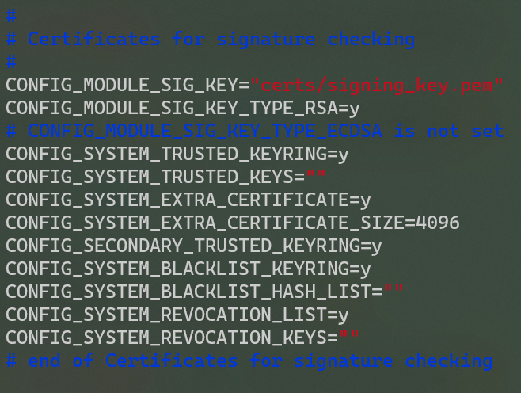

# SwornDisk Linux C 编译 & 测试指南

# 编译使用

## **Step 1. 获取 SwornDisk Linux C 源代码**

```Bash
$ git clone https://gitlab.eduxiji.net/lnhoo/project788067-120160.git
```

## **Step 2. 获取 Linux Kernel 源代码**

```Bash
$ wget https://www.kernel.org/pub/linux/kernel/v5.x/linux-5.17.1.tar.xz
```

## Step 3. 编译 Linux Kernel

- 下载解压内核源码，

```Bash
$ xz -d linux-5.17.1.tar.xz
$ tar xvf linux-5.17.1.tar
$ cd ./linux-5.17.1
```

- 配置、编译内核，

```Bash
$ sudo apt-get install dpkg-dev libncurses5-dev openssl libssl-dev build-essential pkg-config libc6-dev libc6-dev flex libelf-dev zlibc minizip libidn11-dev libidn11-dev bison dwarves
$ make mrproper
$ cp -v /boot/config-$(uname -r) .config
'/boot/config-5.4.0-105-generic' -> '.config'
$ make prepare
$ make scripts
```

- 编辑.config文件，



找到CONFIG_SYSTEM_TRUSTED_KEYS，将值置空；

找到CONFIG_SYSTEM_REVOCATION_KEYS，将值置空。

- 编译、安装内核，

```Bash
$ make -j$(nproc)
$ sudo make modules_install
$ sudo make install
```

- 重启操作系统，选择刚安装的内核版本进入

## Step 4. **编译 SwornDisk Linux C**

- 移除内核源码的drivers/md目录，

```Bash
$ cd linux-5.17.1/drivers/
$ rm -rf -r md/
```

- 将sworndisk源码复制到drivers目录下，并重命名为md

- 开始编译SwornDisk，

```Bash
$ cd md
$ cd ../../
$ make CONFIG_DM_SWORNDISK=m CONFIG_DM_PERSISTENT_DATA=m M=drivers/md
$ make modules_install M=drivers/md
$ cd drivers/md
```

## **Step 5. 加载 SwornDisk 内核模块**

```Bash
$ modprobe -r sworndisk dm-persistent-data 
$ modprobe dm-persistent-data
$ modprobe sworndisk
```

## **Step 6. 创建 SwornDisk 虚拟映射块设备**

- `<size>`: 磁盘扇区数量，扇区大小为 512B

- `<data_dev>`: 数据磁盘对应设备文件

- `<meta_dev>`: 元数据磁盘对应设备文件

- `<name>`: 磁盘名称

```Bash
$ echo 0 <size> sworndisk <data_dev> <meta_dev> 0 | sudo dmsetup create <name>
```

- 实例，

```Bash
# 创建一个 70GB 的 SwornDisk 虚拟块设备
$ echo 0 146800640 sworndisk /dev/sdb /dev/sdc 0 | dmsetup create sworndisk
```

元数据磁盘的容量需要根据设备扇区数量预估，现在的实验环境/dev/sdb容量为75GB，/dev/sdc容量为15GB。

# 性能测试

- 使用 fio 性能测试参考 config:

```Bash
# fio.conf

[global]
ioengine=sync
thread=1
norandommap=1
randrepeat=0
runtime=60
ramp_time=6
size=4G
direct=1
filename=/dev/mapper/sworndisk

[write4k-rand]
stonewall
group_reporting
bs=4k
rw=randwrite
numjobs=1
iodepth=32

[write64k-seq]
stonewall
group_reporting
bs=64k
rw=write
numjobs=1
iodepth=32

[read4k-rand]
stonewall
group_reporting
bs=4k
rw=randread
numjobs=1
iodepth=32

[read64k-seq]
stonewall
group_reporting
bs=64k
rw=read
numjobs=1
iodepth=32
$ fio fio.conf
```