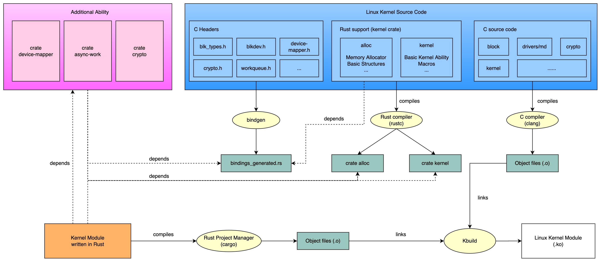
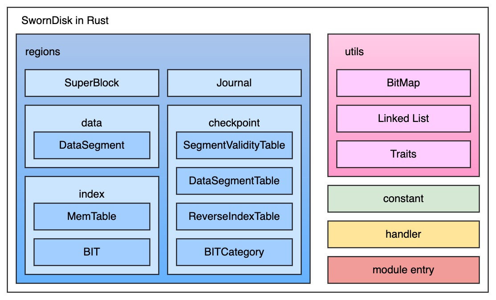

# SwornDisk Linux Rust 框架与模块设计

我们基于 rust-for-linux 项目的基础上做出了一些修改，并且以 Rust crate 的形式添加了额外的能力：

- `device-mapper`：访问 Linux 块设备与 I/O 和 Device Mapper 框架的相关 API
- `crypto`：访问 Linux 加密 API
- `async-work`：访问 Linux 并发工作队列 (CMWQ) API 

SwornDisk Linux Rust 的模块设计如下图：

- `regions`: 实现了 SwornDisk 设计的磁盘布局各区域
  - `superblock`: 超级块
  - `data`: 数据区域实现
  - `index`: 索引区域实现
  - `checkpoint`: 检查点区域实现
- `utils`: 包含数据结构与工具函数的实现
- `constant`: 定义 SwornDisk 设计参数
- `handler`: 处理 I/O 请求的模块
- `module_entry`: 内核模块入口

